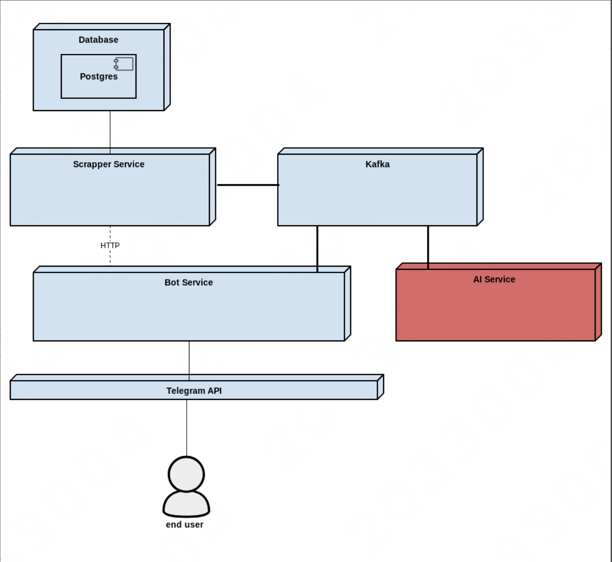

## Запуск:

1. Создать .env файл с переменными {TELEGRAM_TOKEN}, {TELEGRAM_BOT_NAME}, {GITHUB_API_TOKEN}, {STACKOVERFLOW_API_KEY}

2.
```bash
sbt docker:publishLocal
```

3.
```bash
docker-compose up
```

## Архитектура



Три независимых сервиса:

- bot: Telegram бот для взаимодействия с пользователем
- scrapper: сервис для отслеживания ссылок и хранения данных
- ai agent: сервис для обработки сообщений

## Описание сервисов

### Bot Service

Отвечает за взаимодействие с пользователями через Telegram Bot API:

- Регистрация и авторизация пользователей
- Обработка команд (/track, /untrack, /list и др.)
- Управление подписками через взаимодействие со Scrapper Service 
- Отправка уведомлений пользователям 
- Хранение данных о пользователях и их настройках

### Scrapper Service

Осуществляет мониторинг контента:

- Периодическая проверка отслеживаемых URL на наличие изменений 
- Парсинг контента с различных источников (GitHub, Stack Overflow, Reddit и др.)
- Определение изменений (diff detection)
- Отправка уведомлений в Bot Service при обнаружении обновлений 
- Хранение информации о подписках и состоянии контента

Методы коммуникации:

REST API для синхронной коммуникации

Apache Kafka для асинхронной обработки

### AI Agent Service

Обрабатывает контент перед отправкой уведомлений:

- Фильтрация по стоп-словам и авторам

Работает как промежуточное звено между Scrapper и Bot

## Детали
- В application.conf можно выбрать механизм отправки сообщений (kafka/http) и database access-type (sql/orm)

  Модель сообщения для kafka/http одна и та же (см. notification), сообщения передаются в JSON-формате
- База данных PostgreSQL, миграции Liquibase
- Кэширование GET /list с помощью Valkey
- Есть Timeout, Retry, Circuit Breaker, Fallback, Rate Limiting

  Параметры задаются через конфигурацию.


